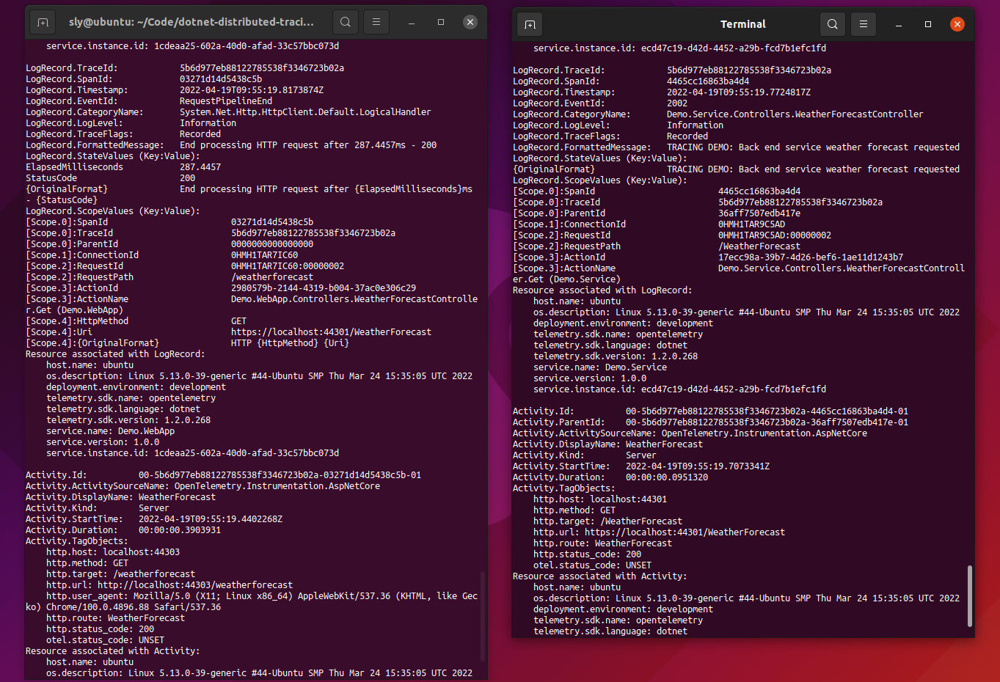

# Dotnet Distributed Tracing Examples

Example of distributed tracing in .NET, using W3C Trace Context and OpenTelemetry.

## a) OpenTelemetry

A basic example using OpenTelemetry, showing correlation between two tiers, exporting both logging and activity tracing to the console, along with service details.

**NOTE:** If you have trouble with HTTPS, or do not have certificates set up, then see the section at
the end of this file for HTTPS Developer Certificates.

### Requirements

* Dotnet 6.0

### Basic app creation

This is the same as for the basic example.

#### New back end service

Create a development certificate (if you are using a different shell, replace the PowerShell variable):

Create a directory for the project and a solution file

```sh
mkdir a-opentelemetry
cd a-opentelemetry
dotnet new sln
dotnet new webapi --output Demo.Service
dotnet sln add Demo.Service
```

Check it works:

```sh
dotnet run --project Demo.Service --urls "https://*:44301" --environment Development
```

Test it in a browser at `https://localhost:44301/WeatherForecast`

#### New web + api server

In another terminal create a react web app. You can specify the proxy port to use for the template:

```sh
cd i-opentelemetry
dotnet new react --output Demo.WebApp --ProxyPort 44303
dotnet sln add Demo.WebApp
```

Check it works. In Linux HTTPS proxying is not working, so you need to run the react proxy server separate from the dotnet API and use HTTP when proxying to the API.

Run the react proxy in on terminal, with the proxy URL set:

```powershell
$ENV:ASPNETCORE_URLS = "http://localhost:8002"
npm run start --prefix Demo.WebApp/ClientApp
```

Then run the API in a separate terminal, with the HTTP URL:

```powershell
dotnet run --project Demo.WebApp --urls "http://*:8002" --environment Development
```

Test it in a browser at `https://localhost:44303`

#### Changes - web app front end

In the Demo.WebApp project, at the end of the main return in `FetchData.js`, add a button to make it easy to call the server.

```javascript
  return (
    <div>
      ...
      <p><button className="btn btn-primary" onClick={() => this.populateWeatherData()}>Refresh</button></p>
    </div>
  );
```

#### Changes - web app api

Rather than return the data directly, have the web app API log a message and forward the call to the service.

Note that `HttpClient` should never be used directly, but via the built in factory to ensure the correct lifecycle is applied. 

.NET 6 LTS simplifies the template and no longer has a separate start up file, so services are configured in the main `Program.cs`.

```csharp
// Add services to the container.
builder.Services.AddHttpClient();
```

Then modify `WeatherForecastController.cs` in the web app to inject `HttpClient`:


```csharp
  private readonly System.Net.Http.HttpClient _httpClient;
  private readonly ILogger<WeatherForecastController> _logger;

  public WeatherForecastController(ILogger<WeatherForecastController> logger, 
      System.Net.Http.HttpClient httpClient)
  {
      _logger = logger;
      _httpClient = httpClient;
  }
```

Then replace the `Get()` method with the following:

```csharp
  [HttpGet]
  public Task<string> Get(System.Threading.CancellationToken cancellationToken)
  {
      _logger.LogInformation(2001, "TRACING DEMO: WebApp API weather forecast request forwarded");
      return _httpClient.GetStringAsync("https://localhost:44301/WeatherForecast", cancellationToken);
  }
```

#### Changes - service

Add log statements in the service `WeatherForecastController.cs`:

```csharp
  public IEnumerable<WeatherForecast> Get()
  {
    _logger.LogInformation(2002, "TRACING DEMO: Back end service weather forecast requested");
    ...
  }
```

### Add OpenTelemetry libraries

See https://opentelemetry.io/docs/instrumentation/net/getting-started/

```
dotnet add Demo.Service package OpenTelemetry.Extensions.Hosting --prerelease
dotnet add Demo.Service package OpenTelemetry.Instrumentation.AspNetCore --prerelease
dotnet add Demo.Service package OpenTelemetry.Exporter.Console

dotnet add Demo.WebApp package OpenTelemetry.Extensions.Hosting --prerelease
dotnet add Demo.WebApp package OpenTelemetry.Instrumentation.AspNetCore --prerelease
dotnet add Demo.WebApp package OpenTelemetry.Instrumentation.Http --prerelease
dotnet add Demo.WebApp package OpenTelemetry.Exporter.Console
```

### Enable OpenTelemetry Logging

Configure OpenTelemetry in the Demo.Service `Program.cs`, adding the namespaces needed at the top, and then configuring a resource builder with the service name and informational (or assembly) version.

```
using OpenTelemetry.Logs;
using OpenTelemetry.Resources;
using OpenTelemetry.Trace;

// Configure OpenTelemetry service resource details
var entryAssembly = System.Reflection.Assembly.GetEntryAssembly();
var entryAssemblyName = entryAssembly?.GetName();
var versionAttribute = entryAssembly?.GetCustomAttributes(false)
    .OfType<System.Reflection.AssemblyInformationalVersionAttribute>()
    .FirstOrDefault();
var resourceBuilder = ResourceBuilder.CreateDefault().AddService(entryAssemblyName?.Name,
    serviceVersion: versionAttribute?.InformationalVersion ?? entryAssemblyName?.Version?.ToString());
```

We can then clear the default loggers (for this example), and add OpenTelemetry with the Console exporter.

```
var builder = WebApplication.CreateBuilder(args);

// Configure logging
builder.Logging.ClearProviders()
    .AddOpenTelemetry(configure =>
    {
        configure
            .SetResourceBuilder(resourceBuilder)
            .AddConsoleExporter();
    });
```

Configure the same in Demo.WebApp.

Note that this configuration is only for this example. Normally you would keep the console logger and set OpenTelemetry to export to your telemetry system.


### Enable OpenTelemetry Activity Tracing

Configure OpenTelemetry in the Demo.Service `Program.cs` services, adding the ASP.NET instrumentation.

```
// Add services to the container.
builder.Services.AddOpenTelemetryTracing(tracerProviderBuilder =>
{
    tracerProviderBuilder
        .AddAspNetCoreInstrumentation()
        .AddConsoleExporter();
});
```

Do similiar in Demo.WebApp, adding both ASP.NET and HTTP instrumentation.

```
builder.Services.AddOpenTelemetryTracing(tracerProviderBuilder =>
{
    tracerProviderBuilder
        .AddAspNetCoreInstrumentation()
        .AddHttpClientInstrumentation()
        .AddConsoleExporter();
});
```


### Run the services

In separate terminals run the service:

```powershell
dotnet run --project Demo.Service --urls "https://*:44301" --environment Development
```

To run the web app front end you need to configure the web API address it will use via an environment variable:

```powershell
$ENV:ASPNETCORE_URLS = "http://localhost:8002"
npm run start --prefix Demo.WebApp/ClientApp
```

Then run the web api in a third terminal:

```powershell
dotnet run --project Demo.WebApp --urls "http://*:8002" --environment Development
```

Check the front end at `https://localhost:44303/fetch-data` and see the OpenTelemetry tracing details logged to the console.



Activity traces are recorded when they complete, so you will see the inner Activity in the back end service listed first, and see that it's Activity.ParentId is the HttpClient Activity in the web API, and see the last it's parent (also in the web API) is the web API request Activity.

Also shown are the LogRecord entries, from both system logs and the application log in the back end service (the other logs are off the screen, as the console exporter is quite verbose). The SpanIds for the LogRecords match the Activity traces they are related to.

You can also see the service details with the name, version, and instance ID.


## HTTPS Developer Certificates

### Windows and macOS

See: https://docs.microsoft.com/en-us/aspnet/core/security/enforcing-ssl?view=aspnetcore-5.0&tabs=visual-studio#trust-the-aspnet-core-https-development-certificate-on-windows-and-macos

The certificate is automatically installed. To trust the certificate:

```
dotnet dev-certs https --trust
```

### Ubuntu

See: https://docs.microsoft.com/en-us/aspnet/core/security/enforcing-ssl?view=aspnetcore-5.0&tabs=visual-studio#ubuntu-trust-the-certificate-for-service-to-service-communication

Create the HTTPS developer certificate for the current user personal certificate store (if not already initialised). 

```
dotnet dev-certs https
```

You can check the certificate exists for the current user; the file name is the SHA1 thumbprint. (If you want to clear out previous certificates use `dotnet dev-certs https --clean`, which will delete the file.)

```
ls ~/.dotnet/corefx/cryptography/x509stores/my
```

#### Trust the certificate for server communication

You need to have OpenSSL installed (check with `openssl version`).

Install the certificate. You need to use the `-E` flag with `sudo` when exporting the file, so that it exports the file for the current user (otherwise it will export the file for root, which will be different).

```
sudo -E dotnet dev-certs https -ep /usr/local/share/ca-certificates/aspnet/https.crt --format PEM
sudo update-ca-certificates
```

You can check the file exists, and then use open SSL to verify it has the same SHA1 thumbprint.

```
ls /usr/local/share/ca-certificates/aspnet
openssl x509 -noout -fingerprint -sha1 -inform pem -in /usr/local/share/ca-certificates/aspnet/https.crt
```

If the thumbprints do not match, you may have install the root (sudo user) certificate. You can check it at `sudo ls -la /root/.dotnet/corefx/cryptography/x509stores/my`.

#### Trust in Chrome

```
sudo apt-get install -y libnss3-tools
certutil -d sql:$HOME/.pki/nssdb -A -t "P,," -n localhost -i /usr/local/share/ca-certificates/aspnet/https.crt
certutil -d sql:$HOME/.pki/nssdb -A -t "C,," -n localhost -i /usr/local/share/ca-certificates/aspnet/https.crt
```

#### Trust in Firefox:

```
cat <<EOF | sudo tee /usr/lib/firefox/distribution/policies.json
{
    "policies": {
        "Certificates": {
            "Install": [
                "/usr/local/share/ca-certificates/aspnet/https.crt"
            ]
        }
    }
}
EOF
```
