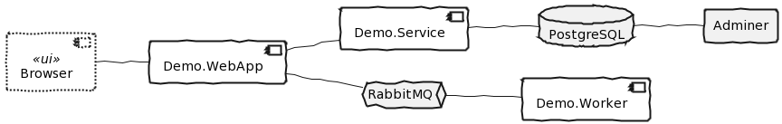
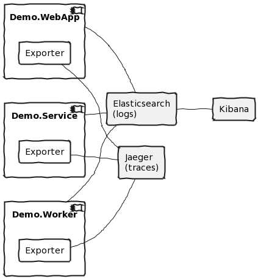
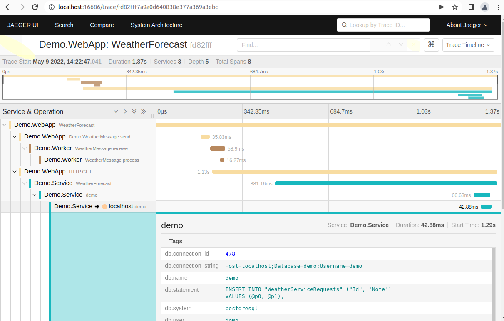
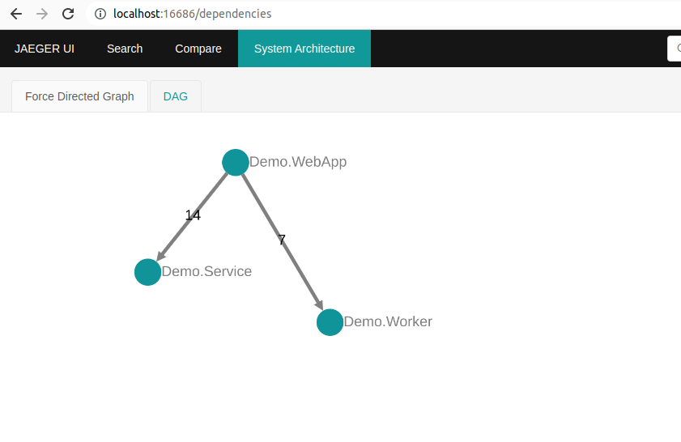
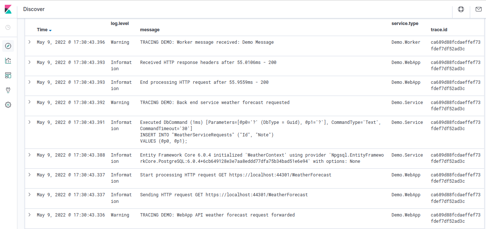

**Dotnet Distributed Tracing Examples**

Example of distributed tracing in .NET, using W3C Trace Context and OpenTelemetry.

(c) Complex OpenTelemetry example
=================================

An OpenTelemetry example, with multiple components include adding message bus and SQL server, writing to both Jaeger, for tracing, and Elasticsearch, for logs.

The code components include a client browser single page application, Demo.WebApp, Demo.Service, and Demo.Worker. The
web app and worker are connected through RabbitMQ, and the service is connected to a PostgreSQL database. This
example shows distributed tracing across multiple components, including asynchronous messaging.




Requirements
------------

* Dotnet 6.0
* Docker (with docker compose), for local services

This example builds off the basic OpenTelemetry example, with Demo.WebApp and Demo.Service communicating and sending
traces and logs to the OpenTelemetry console exporter.


Run local services (Elasticsearch, Jaeger, RabbitMQ, and PostgreSQL)
--------------------------------------------------------------------

For this complex example, you need to be running local Elasticsearch to send 
log messages to, and a local Jaeger service to send distributed tracing 
information to. 

You also need to run Rabbit MQ, for a service bus, and PostgreSQL, for a database.

For example on Linux a docker compose configuration is provided that runs all
components. To run the compose file:

```bash
docker compose -p demo up -d
```

### Jaeger

For more details see https://www.jaegertracing.io/

To check the Jaeger UI, browse to `http://localhost:16686/`

### Elasticsearch and Kibana

There are a number of prerequesites that you will need to meet, such as enough 
file handles; the elk-docker project provides a good list, including 
some troubleshooting (see https://elk-docker.readthedocs.io/).

For example, the most common issue is mmap count limit, which can be changed via: 

```bash
echo vm.max_map_count=262144 | sudo tee -a /etc/sysctl.conf
sudo sysctl -p
```

To check the Kibana console, browse to `http://localhost:5601`

(I had issues in Chrome, and had to use Firefox for some of the local sites.)

### RabbitMQ

For more details see https://www.rabbitmq.com/

To check the RabbitMQ console, browse to `http://localhost:15672`

### PostgreSQL and Adminer

For more details see https://www.postgresql.org/

To check the Adminer console, browse to `http://localhost:8080`


Adding a message bus
--------------------

### Send a message

This example uses the MassTransit library wth RabbitMQ as the transport, based on https://masstransit-project.com/quick-starts/rabbitmq.html.

There is also an OpenTelemetry instrumentation library for MassTransit.

First add the required packages to the Web App project, which will send the message:

```bash
dotnet add Demo.WebApp package MassTransit.RabbitMQ
```

Then add configuration settings to `appsettings.Development.json`, based on the set up of docker:

```json
  "MassTransit": {
    "RabbitMq": {
      "Host": "localhost",
      "Port": 5672,
      "VirtualHost": "/",
      "Username": "user",
      "Password": "password"
    }
  }
```

Configure the service in `Program.cs`, with the namespace:

```csharp
using MassTransit;
```

Then register the MassTransit service configured with RabbitMQ:

```csharp
builder.Services.AddMassTransit(mtConfig => {
  mtConfig.UsingRabbitMq((context, rabbitConfig) => {
    rabbitConfig.Host(builder.Configuration.GetValue<string>("MassTransit:RabbitMq:Host"),
      builder.Configuration.GetValue<ushort>("MassTransit:RabbitMq:Port"),
      builder.Configuration.GetValue<string>("MassTransit:RabbitMq:VirtualHost"),
      hostConfig => {
        hostConfig.Username(builder.Configuration.GetValue<string>("MassTransit:RabbitMq:Username"));
        hostConfig.Password(builder.Configuration.GetValue<string>("MassTransit:RabbitMq:Password"));
      }
    );
  });
});
```

Add a new class `WeatherMessage.cs` with an interface for the message we are sending. The full name,
including the namespace, is used for configuring messaging and needs to be the same on both the sender
and receiver:

```csharp
namespace Demo;

public interface WeatherMessage
{
    string Note { get; }
}
```

In `WeatherForecastController.cs` inject the MassTransit publisher into the constructor:

```csharp
  private readonly MassTransit.IPublishEndpoint _publishEndpoint;
  
  public WeatherForecastController(..., 
      MassTransit.IPublishEndpoint publishEndpoint)
  {
    ...
    _publishEndpoint = publishEndpoint;
  }
```

Then change the request handler to async and publish a message with the interface type before returning the result:

```csharp
  [HttpGet]
  public async Task<string> Get(System.Threading.CancellationToken cancellationToken)
  {
    _logger.LogWarning(4001, "TRACING DEMO: WebApp API weather forecast request forwarded");
    var result = await _httpClient.GetStringAsync("https://localhost:44301/WeatherForecast", cancellationToken);
    await _publishEndpoint.Publish<Demo.WeatherMessage>(new { Note = "Demo Message" }, cancellationToken);
    return result;
  }
```


Add a console worker app to receive the message
-----------------------------------------------

Create a console app and add the logging and Azure message bus packages

```bash
dotnet new worker --output Demo.Worker
dotnet sln add Demo.Worker
dotnet add Demo.Worker package MassTransit.RabbitMQ
```

Add configuration settings to `appsettings.Development.json`, based on the set up of docker:

```json
  "MassTransit": {
    "RabbitMq": {
      "Host": "localhost",
      "Port": 5672,
      "VirtualHost": "/",
      "Username": "user",
      "Password": "password"
    }
  }
```

Add a `WeatherMessage.cs` interface exactly the same (including namespace) as in `Demo.WebApp`.

```csharp
namespace Demo;

public interface WeatherMessage
{
    string Note { get; }
}
```

Add a simple `WeatherMessageConsumer.cs` class that will handle the incoming messages and log them. Add a delay to simulate doing work.

```csharp
using MassTransit;

namespace Demo.Worker;

public class WeatherMessageConsumer : IConsumer<WeatherMessage>
{
    private readonly ILogger _logger;

    public WeatherMessageConsumer(ILogger<WeatherMessageConsumer> logger)
    {
        _logger = logger;
    }

    public async Task Consume(ConsumeContext<WeatherMessage> context)
    {
        _logger.LogWarning(4002, "TRACING DEMO: Worker message received: {Note}", context.Message.Note);
        await Task.Delay(TimeSpan.FromMilliseconds(200), context.CancellationToken);
    }
}
```

As this is a worker project, you will also need to add a `MassTransitServiceHost.cs` to host the Mass Transit bus.

```csharp
using MassTransit;

namespace Demo.Worker;

public class MassTransitServiceHost : IHostedService
{
    private readonly IBusControl _bus;

    public MassTransitServiceHost(IBusControl bus)
    {
        _bus = bus;
    }

    public Task StartAsync(CancellationToken cancellationToken) => _bus.StartAsync(cancellationToken);

    public Task StopAsync(CancellationToken cancellationToken) => _bus.StopAsync(cancellationToken);
}
```

Then configure MassTransit in `Program.cs` to enable the service host and use the consumer (and remove
the default `Worker.cs` that we are not using):

```csharp
using MassTransit;

...

  Host.CreateDefaultBuilder(args)
    ...
    .ConfigureServices(services => {
      services.AddHostedService<MassTransitServiceHost>();
      services.AddMassTransit(mtConfig => {
        mtConfig.AddConsumer<WeatherMessageConsumer>();
         mtConfig.UsingRabbitMq((context, rabbitConfig) => {
          rabbitConfig.Host(hostBuilderContext.Configuration.GetValue<string>("MassTransit:RabbitMq:Host"),
            hostBuilderContext.Configuration.GetValue<ushort>("MassTransit:RabbitMq:Port"),
            hostBuilderContext.Configuration.GetValue<string>("MassTransit:RabbitMq:VirtualHost"),
            hostConfig => {
              hostConfig.Username(hostBuilderContext.Configuration.GetValue<string>("MassTransit:RabbitMq:Username"));
              hostConfig.Password(hostBuilderContext.Configuration.GetValue<string>("MassTransit:RabbitMq:Password"));
            }
          );
          rabbitConfig.ConfigureEndpoints(context);
        });
      });
  ...
```


Adding a database
-----------------

We will set up Demo.Service to access a database. First add the PostgreSQL Entity Framework package:

```bash
dotnet add Demo.Service package Npgsql.EntityFrameworkCore.PostgreSQL
dotnet add Demo.Service package Microsoft.EntityFrameworkCore.Design
```

Add a connection string to `appsettings.Development.json` (in Demo.Service) for the database running in docker:

```json
  "ConnectionStrings": {
    "WeatherContext": "Host=localhost;Database=demo;Username=demo;Password=password"
  },
  ...
```

Create a database context class `WeatherContext.cs`:

```csharp
using Microsoft.EntityFrameworkCore;

namespace Demo.Service;

public class WeatherContext : DbContext
{
    public WeatherContext(DbContextOptions<WeatherContext> context) : base(context) { }

    public DbSet<WeatherServiceRequest> WeatherServiceRequests { get; set; } = null!;
}

public class WeatherServiceRequest
{
    public Guid Id { get; set; }
    public string Note { get; set; } = string.Empty;
}
```

Add the database context to the services in `Program.cs`:

```csharp
// Add database
builder.Services.AddDbContext<WeatherContext>(options =>
    options.UseNpgsql(builder.Configuration.GetConnectionString("WeatherContext")));
```

Add code to the `WeatherForecastController.cs` to write to the database.

```csharp
    private readonly WeatherContext _weatherContext;

    public WeatherForecastController(ILogger<WeatherForecastController> logger, WeatherContext weatherContext)
    {
        _weatherContext = weatherContext;
    ...

    public IEnumerable<WeatherForecast> Get()
    {
        _weatherContext.WeatherServiceRequests.Add(new WeatherServiceRequest() {Note = "Demo Note"});
        _weatherContext.SaveChanges();
        ...
```

### Create the database using Entity Framework migrations

Ensure the Entity Framework tools are installed:

```bash
dotnet new tool-manifest
dotnet tool install dotnet-ef
```

Create a migration to add the configured entity.

```bash
dotnet ef migrations add SetupWeatherDatabase --project Demo.Service
```

Apply the migration to the development database:

```bash
dotnet ef database update --project Demo.Service
```

Observability configuration
---------------------------

The three application components are then configured with standard .NET logs sent to Elasticsearch (viewed with Kibana) and traces sent via the OpenTelemetry Jaeger Exporter to Jaeger.




Configure logging
-----------------

A logger provider is available that can write directly to Elasticsearch. It can be installed via nuget.

```bash
dotnet add Demo.WebApp package Elasticsearch.Extensions.Logging --version 1.6.0-alpha1
dotnet add Demo.Service package Elasticsearch.Extensions.Logging --version 1.6.0-alpha1
dotnet add Demo.Worker package Elasticsearch.Extensions.Logging --version 1.6.0-alpha1
```

To use the logger provider you need add a using statement at the top of `Program.cs`:

```csharp
using Elasticsearch.Extensions.Logging;
```

Change the logging configuration to keep the default console instead of OpenTelemetry, i.e. remove ClearLoggers() and the OpenTelemetry console logger, and add Elasticsearch. 

For now it should look like this in Demo.WebApp and Demo.Service:

```csharp
// Configure logging
builder.Logging
    .AddOpenTelemetry(configure =>
    {
    })
    .AddElasticsearch();
```

And like this in Demo.Worker:

```csharp
  Host.CreateDefaultBuilder(args)
    .ConfigureLogging((hostContext, loggingBuilder) =>
    {
        loggingBuilder.AddElasticsearch();
    })
  ...
```

### Testing logging

At this point you should be able to run the client server and all three back end applications, then use a browser to access the UI, and see components logging to Elasticsearch.

There is a combined script that will use **tmux** to open a split window with all projects running:

```bash
./start-complex-demo.sh
```

You can then browse to `https://localhost:44303/fetch-data` and see the requests working.

Note that the web requests will pass the distributed trace identifiers (built in to `HttpClient` and ASP.NET), however the trace details are not passed across the RabbitMQ message bus by default.


Configure tracing
-----------------

OpenTelemetry can be used to automatically instrument the application, and provide full instrumentation.

### Add packages

First of all each project needs the basic OpenTelemetry libraries, relevant instrumentation packages, and exporters:

```
dotnet add Demo.WebApp package OpenTelemetry.Extensions.Hosting --prerelease
dotnet add Demo.WebApp package OpenTelemetry.Instrumentation.AspNetCore --prerelease
dotnet add Demo.WebApp package OpenTelemetry.Instrumentation.Http --prerelease
dotnet add Demo.WebApp package OpenTelemetry.Exporter.Jaeger

dotnet add Demo.Service package OpenTelemetry.Extensions.Hosting --prerelease
dotnet add Demo.Service package OpenTelemetry.Instrumentation.AspNetCore --prerelease
dotnet add Demo.Service package OpenTelemetry.Contrib.Instrumentation.EntityFrameworkCore --prerelease
dotnet add Demo.Service package Npgsql.OpenTelemetry
dotnet add Demo.Service package OpenTelemetry.Exporter.Jaeger

dotnet add Demo.Worker package OpenTelemetry.Extensions.Hosting --prerelease
dotnet add Demo.Worker package OpenTelemetry.Exporter.Jaeger
```

### Configure the OpenTelemetry ResourceBuilder

Then configure each of the applications.

In the `Program.cs` file of each application, first configure the OpenTelemety resource builder. You can provide additional attributes following the [OpenTelemetry semantic conventions](https://github.com/open-telemetry/opentelemetry-specification/tree/main/specification/resource/semantic_conventions)

```csharp
using OpenTelemetry.Resources;
...

var entryAssembly = System.Reflection.Assembly.GetEntryAssembly();
var entryAssemblyName = entryAssembly?.GetName();
var versionAttribute = entryAssembly?.GetCustomAttributes(false)
    .OfType<System.Reflection.AssemblyInformationalVersionAttribute>()
    .FirstOrDefault();
var serviceName = entryAssemblyName?.Name;
var serviceVersion = versionAttribute?.InformationalVersion ?? entryAssemblyName?.Version?.ToString();
var attributes = new Dictionary<string, object>
{
    ["host.name"] = Environment.MachineName,
    ["os.description"] = System.Runtime.InteropServices.RuntimeInformation.OSDescription,
    ["deployment.environment"] = builder.Environment.EnvironmentName.ToLowerInvariant()
};
var resourceBuilder = ResourceBuilder.CreateDefault()
    .AddService(serviceName, serviceVersion: serviceVersion)
    .AddTelemetrySdk()
    .AddAttributes(attributes);
```

In `Demo.Worker` getting the environment name uses a slightly different property.

```csharp
["deployment.environment"] = hostBuilderContext.HostingEnvironment.EnvironmentName.ToLowerInvariant()
```

### Add OpenTelemetry tracing

Then configure the OpenTelemetry tracing with the required instrumentation, sources, and exporters.

In `Demo.WebApp` add AspNetCore and HttpClient instrumentation, the MassTransit source, and the Jaeger exporter: 

```csharp
builder.Services.AddOpenTelemetryTracing(tracerProviderBuilder =>
{
    tracerProviderBuilder
        .SetResourceBuilder(resourceBuilder)
        .AddAspNetCoreInstrumentation()
        .AddHttpClientInstrumentation()
        .AddSource("MassTransit")
        .AddJaegerExporter();
});
```

In `Demo.Service` add AspNetCore, EntityFrameworkCore, and Npgsql instrumentation, and the Jaeger exporter: 

```csharp
using Npgsql;
using OpenTelemetry.Trace;
...

builder.Services.AddOpenTelemetryTracing(configure =>
{
    configure
        .SetResourceBuilder(resourceBuilder)
        .AddAspNetCoreInstrumentation()
        .AddEntityFrameworkCoreInstrumentation()
        .AddNpgsql()
        .AddJaegerExporter();
});
```

In `Demo.Worker` add just the MassTransit source, and the Jaeger exporter. In the worker project you are also adding direct to `services`.

```csharp
using OpenTelemetry.Resources;
...

services.AddOpenTelemetryTracing(tracerProviderBuilder =>
{
    tracerProviderBuilder
        .SetResourceBuilder(resourceBuilder)
        .AddSource("MassTransit")
        .AddJaegerExporter();
});
```

#### Note on MassTransit version 7

MassTransit version 8 has support for OpenTelemetry build in, with a named `ActivitySource`. All you need to do is add the source to your configuration.

For the earlier version 7 there is an instrumentation package which you can add to your project, `OpenTelemetry.Contrib.Instrumentation.MassTransit`, and then use the extension method in the package `AddMassTransitInstrumentation()`.

This package subscribes to the `DiagnosticsSource` used in the earlier version of MassTransit and converts and forwards events to OpenTelemetry.


View OpenTelemetry tracing in Jaeger
------------------------------------

### Run the services

In separate terminals run the service:

```powershell
dotnet run --project Demo.Service --urls "https://*:44301" --environment Development
```

To run the web app front end you need to configure the web API address it will use via an environment variable:

```powershell
$ENV:ASPNETCORE_URLS = "http://localhost:8002"
npm run start --prefix Demo.WebApp/ClientApp
```

Then run the web api in a third terminal:

```powershell
dotnet run --project Demo.WebApp --urls "http://*:8002" --environment Development
```

And run the worker app in a fourth terminal

```powershell
dotnet run --project Demo.Worker --environment Development
```

Generate some activity via the front end at `https://localhost:44303/fetch-data`.

#### Using tmux

There is also a combined script that will use **tmux** to open a split window with both projects running:

```bash
./start-complex-demo.sh
```

### View Jaeger traces

To see the traces in the Jaeger UI, browse to `http://localhost:16686/`, and the Elasticsearch logs can be seen in Kibana at `http://localhost:5601`

#### Jaeger - trace spans

None of the trace information was added manually. The different activity spans, and passing the activity trace ID correlation across tiers is either built into components (.NET and MassTransit), or added by the instrumentation libraries.

All you need to do to enable it is add an exporter, such as Jaeger, to collect the output.



The three components, and the spans within each component are visible in the timeline. You can see the asynchronus message processing happens after the primary span has completed.

#### Jaeger - messaging architecture

Jaeger can also generate a system architecture diagram based on the child/parent span relationships in traces between components. This shows which components call other components.

The diagram is fairly simple with only three components in the system, but can be very useful for investgating larger systems.



#### Elasticsearch - logs with correlated trace IDs

With tracing instrumentation enable, the trace IDs are now passed across tiers and are included in logging messages.

No changes had to be made to our application code, which just uses the standard .NET `ILogger<T>`.



